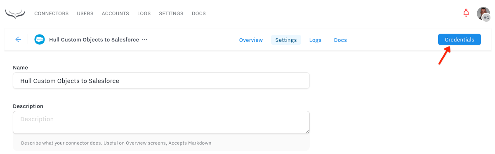
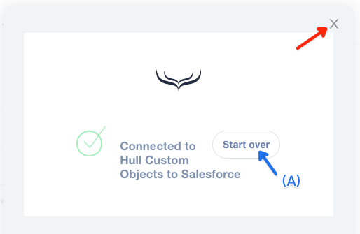

# Hull Salesforce Event to Custom Object

This Connector enables you to send Hull events as custom objects into Salesforce. Common use cases are the tracking of touchpoints are subscription changes.

## Setup a custom connected app in Salesforce

Before you can configure this connector, a custom connected app is required in Salesforce.
If you don't have sufficient permissions to do so, please involve your Salesforce Administrator.

To create a connected app in Salesforce, switch to your `Setup` and select

`Platform Tools > Apps > App Manager`

from the menu.

Once the App Manager is loaded click on the button `New Connected App`:


On the next screen some information is needed, let's start with the basic section:


Salesforce requires a name for the app, which goes into `Connected App Name` (1) and an email address where any errors or inquiries within your organization can be sent to which is `Contact Email` (2). Those two fields are mandatory. Salesforce will automatically populate the `API Name` (3), but you can customize it to your organization's requirements.

After you have filled out the Basic Information, you can proceed to configure the OAuth settings which will enable to app to establish a secure connection between Hull and Salesforce. Scroll down until you find the section `API (Enable OAuth Settings)`. Initially the section will only show the checkbox `Enable OAuth Settings`, once you activate it you will be presented with the following options:


Enter the following addresses as separate lines in `Callback URL` (1):

* `https://hull-salesforce-event-cobject.herokuapp.com/auth/callback`
* `https://hull-salesforce-event-cobject.ngrok.io/auth/callback`

Continue with selecting the necessary scopes to allow the connector to run in the background by selecting the following in `Selected OAuth Scopes` (2):

* `Access and manage your data (api)`
* `Access your basic information (id, profile, email, address, phone)`
* `Allow access to your unique identifier (openid)`
* `Perform requests on your behalf at any time (refresh_token, offline_access)`

That's all, now you can save your newly created app.

> It will take between 2-10 minutes for Salesforce to activate the new app. If you see authentication errors during this time it is because the app has not been activated yet. Please wait some more minutes before you retry again.

## Configure your application in the Connector

Once you have succesfully created your custom connected app in Salesforce, we can use its credentials and configure the connector. To do so we need two pieces of information from the App Manager screen in Salesforce:


Copy the `Consumer Key` (1) and the `Consumer Secret` (2) over into the respective fields of the Settings screen on the Hull Dashboard:


Now make sure to click the button `[Save Changes]` to store this information in the settings of your connector, before you authenticate with Salesforce.

## Authenticate with Salesforce

Now that we have a) setup a custom app in Salesforce and b) configured the connectivity in the Connector settings, it is time to authenticate with Salesforce so we can finish the configuration of our business logic.

> If you want to connect to a **Sandbox Environment** make sure that you have configured the url of your sandbox instead of the production url in your Settings. (Read more in "Configure a connection to a Sandbox Environment")

Click on the button `[Credentials]` on the top right of your Settings screen:



This will open a dialog window where you can start the OAuth authentication flow by clicking on the button `[Continue with Salesforce]`:


After you have confirmed to allow access and the OAuth flow has finished, you will see a confirmation message being displayed:



You can now just close this screen. If you ever need to **re-authenticate** with a different user or because the access token is expired, you can do so by clicking the button `[Start over]` (A).

## Configure the business logic

After you have authenticated your Connector with Salesforce, you can take care of configuring the business logic.
The business logic consists of three distinct parts:

* Select which Hull event is linked to a given Salesforce custom object.
* Determine how Hull can uniquely identify the Salesforce custom object.
* Specify references to other objects in Salesforce.
* Configure which Hull event property is mapped to what field of the Salesforce custom object.

### Object Selection

Before we can configure any other part of the business logic, we need to define what Hull event we want to link to which custom object in Salesforce.

> Yes you read that correct, you can only map one Hull event to one Salesforce custom object. The mapping of multiple events to the same custom object is not supported at this time. You can install of course multiple connectors to do so.

Locate the section `Object Selection` in the Settings of your Connector and pick from the dropdown lists the desired `Hull Event` (1) and the targeted `Salesforce Custom Object` (2):


Before you continue, make sure to click the `[Save changes]` buttons so the connector knows for which custom object it needs to fetch fields from the Salesforce API.

> If you see an empty list for `Salesforce Custom Object` (2) or any subsequent field that is related to Salesforce, this is most likely because responses are cached. In this case reload the webpage to force the Connector to fetch fresh information from Salesforce.

### Identity Resolution

Now that we know about which Hull event and which Salesforce custom object we are talking about, it is time to teach the Connector how it can identify the Salesforce custom object. This is to avoid duplicates in Salesforce and to be able to update objects based on updates which might happen to your Hull event.

We need to determine the `Hull Event ID` (1) and the `Salesforce Custom Object ID` (2):


For the Hull Event ID there is currently no input help available, so you have to be cautious configuring this part. While you can pick any piece of data which is available in your chosen event, keep in mind how an event is structured in the Hull API. What you pick here must match the technical name, not the display name. So here is a quick refresher on the structure of an event in Hull:

``` javascript
{
    id: "<UNIQUE KEY>",
    created_at: "<ISO 8601 Timestamp>",
    session_id: "<IF ANY>",
    source: "<CONNECTOR NAME>",
    event: "<NAME OF THE EVENT>",
    properties: {
        attribute1: "test",
        attribute2: true
    },
    context: {
        ip: "8.8.8.8",
        useragent: "<BROWSER INFO>"
    }
}
```

You can read more about events in our [Hull Docs](https://www.hull.io/docs/concepts/events/).

For most use cases you want to select `id` from the Hull event and map it against a unique field in Salesforce.

So now let's talk about the `Salesforce Custom Object ID` (2) in more detail so you can configure your object accordingly. The Connector is performing a torough check on the fields it allows you to map to and you will only be able to pick a field which matches the following criteria:

* The field must be defined as **unique** in Salesforce
* The field must be **editable** for the user who authenticated the Connector

Having said this, the default identifier of type `Name` created by Salesforce for new cutom objects doesn't fulfill this criteria, hence you cannot use it.

If your identifier is not a number, you are probably best of if you define a field of type `Text` with the following options set:


> If you see an empty list for `Salesforce Custom Object ID` (2) this is most likely because none of your fields matches the criteria or if you just created it, because responses are cached. In the latter case reload the webpage to force the Connector to fetch fresh information from Salesforce.

**___WARNING___: Please be torough when configuring the Identity Resolution otherwise you might end up with many duplicate records in Salesforce or with many unnecessary API calls which block other systems from communicating with Salesforce. If you are not sure how to configure this please consult your Salesforce administrator or the Hull support team.**

### Reference Mapping

Reference mapping refers to the process of associating the Salesforce custom object with other objects in Salesforce. **This section is optional and not required**, if it doesn't apply to your use-case, you can skip it.


Reference mapping allows you to pick any attribute (1) stored on a Hull user or account which represents an identifier of another Salesforce object and map it to a Lookup field (2) on your Salesforce custom object.

If you haven't configured any lookup fields on your Salesforce custom object the dropdown list for `Salesforce Field` will show empty.

### Object Mapping

Now to the integral part of your business logic, let's configure which `Hull property` (1) from the event gets mapped to which `Salesforce field` (2):


Again for the `Hull Property`, there is no input help available at the moment, so please be careful when entering your choices. What you define here must match the technical name of the event as described in the section "Identity Resolution" above.

You can choose any editable field in the `Salesforce Field` dropdown. Please note the Connector will ignore incomplete mappings. If you specify the same field twice the latest entry will win and overwrite any previous entry, so this approach is not suitable for fallback strategies in any way or sense.


## Connecting to a Sandbox environment

If you need to connect to a Sandbox environment, please enter the URL of your environment or `https://test.salesforce.com` in `Salesforce Login Url`:


